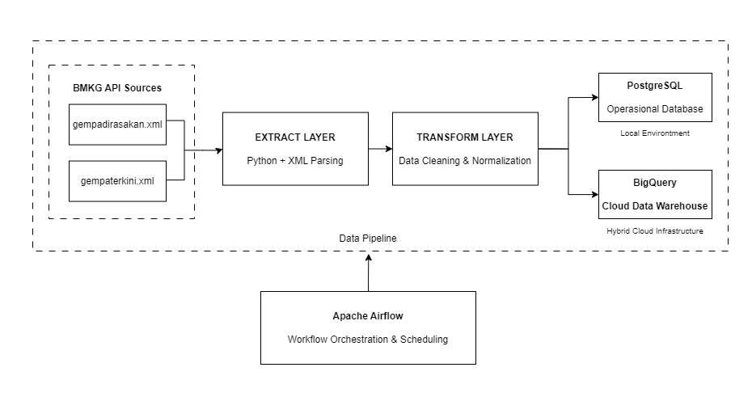
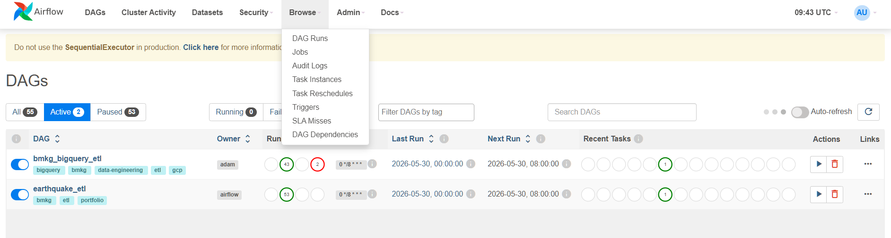
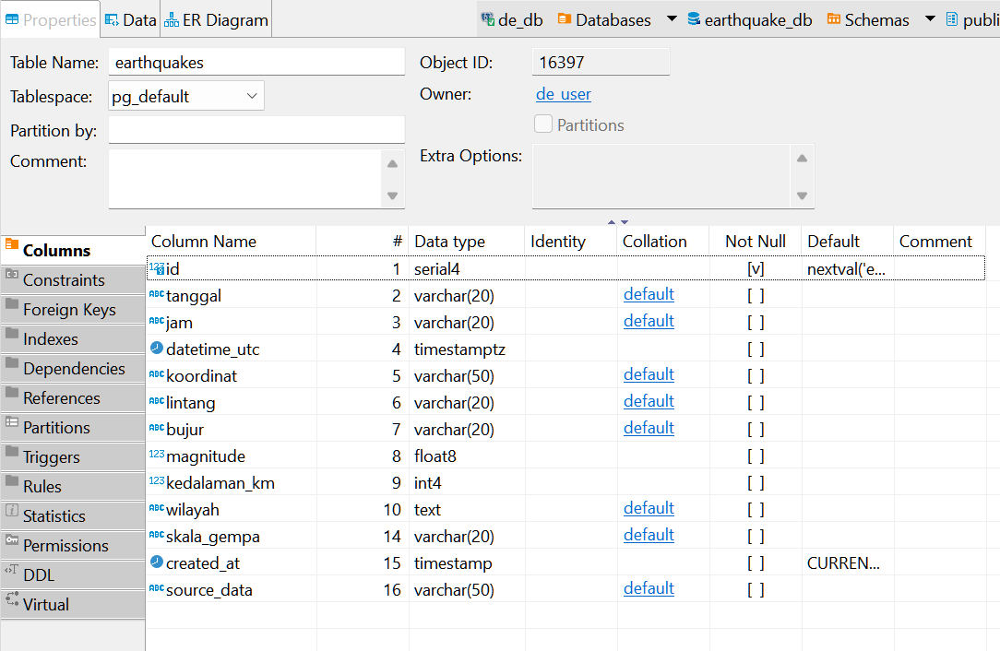
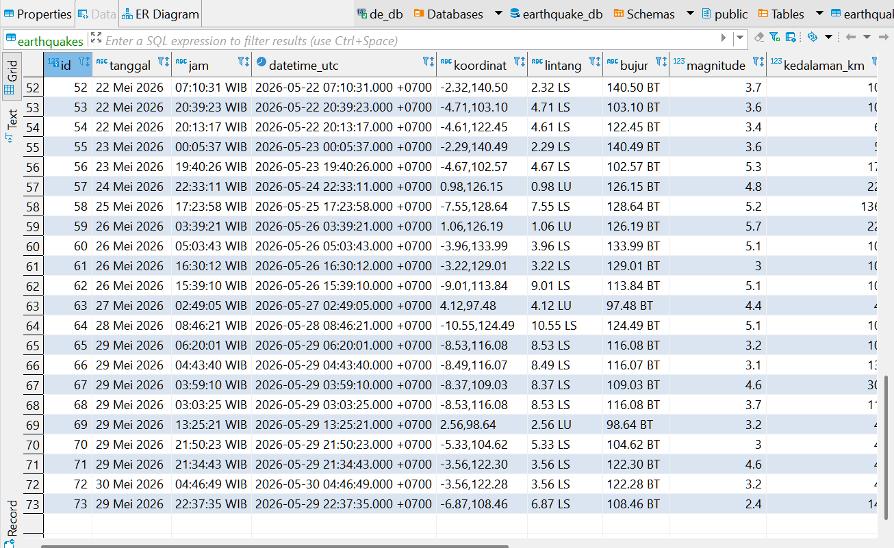
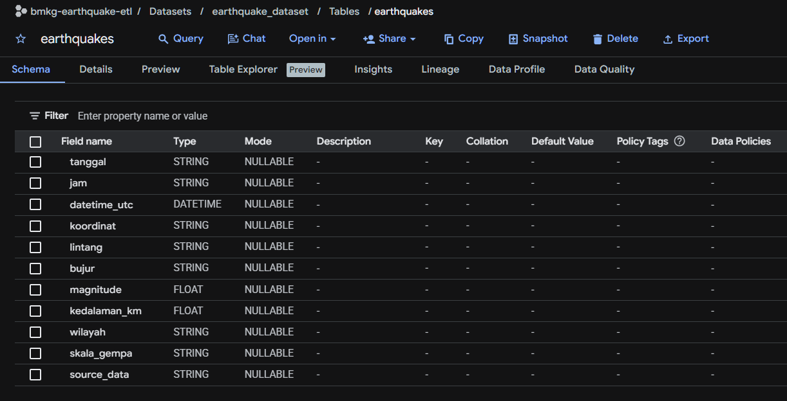
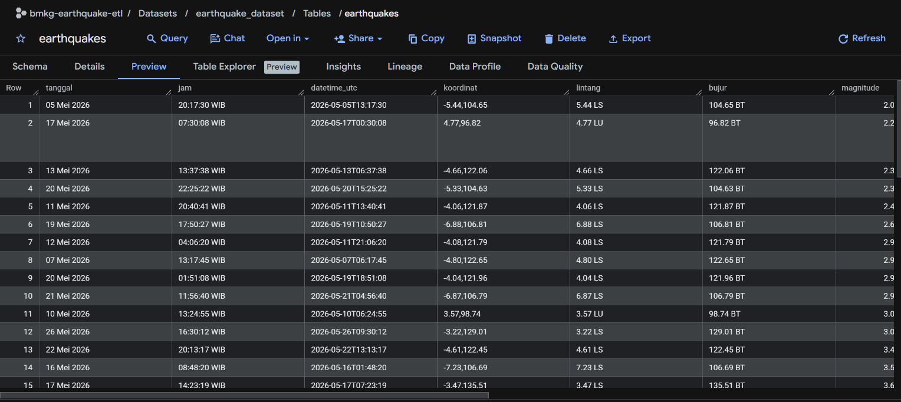
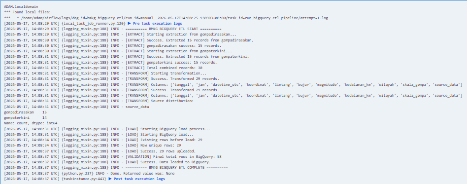

# BMKG Earthquake ETL Pipeline

## Overview

BMKG Earthquake ETL Pipeline merupakan mini project Data Engineering yang mensimulasikan proses **end-to-end ETL (Extract, Transform, Load)** menggunakan data gempa bumi real-time dari **BMKG (Badan Meteorologi, Klimatologi, dan Geofisika)**.

Pipeline melakukan ekstraksi data dari dua endpoint XML BMKG, melakukan transformasi dan normalisasi data, kemudian memuat hasilnya ke **PostgreSQL** sebagai operational database dan **Google BigQuery** sebagai cloud analytical data warehouse. Seluruh workflow diorkestrasi menggunakan **Apache Airflow** untuk mendukung automation dan scheduling.

Project ini awalnya dikembangkan menggunakan local environment dengan PostgreSQL, kemudian di-upgrade menjadi **Hybrid Cloud Architecture** melalui integrasi Google BigQuery untuk mensimulasikan workflow Data Engineering pada ekosistem Google Cloud Platform (GCP).

**Data Gempabumi diambil dari portal resmi BMKG (Badan Meteorologi, Klimatologi, dan Geofisika).**

Sumber data: 
https://data.bmkg.go.id/gempabumi

---

## Key Features

- Multi-source XML data ingestion
- Schema normalization
- Data cleaning & transformation
- Incremental loading
- Deduplication logic
- Apache Airflow orchestration
- PostgreSQL integration
- Google BigQuery integration
- Hybrid cloud architecture
- IAM Service Account authentication

---

## Tech Stack

| Category | Technology |
|----------|------------|
| Programming Language | Python |
| Workflow Orchestration | Apache Airflow |
| Relational Database | PostgreSQL |
| Cloud Data Warehouse | Google BigQuery |
| Data Processing | Pandas |
| XML Parsing | ElementTree |
| Cloud Platform | Google Cloud Platform |
| Authentication | IAM Service Account |
| Database Utilities | SQLAlchemy, psycopg2 |

---

# Project Architecture

Pipeline terdiri dari empat layer utama yaitu **Data Source**, **Extract**, **Transform**, dan **Load**. Data diekstraksi dari dua endpoint XML BMKG, dinormalisasi menjadi satu schema, kemudian dimuat ke PostgreSQL maupun Google BigQuery. Seluruh workflow dijalankan menggunakan Apache Airflow melalui konsep **Directed Acyclic Graph (DAG)** sehingga proses ETL dapat dijalankan secara otomatis berdasarkan jadwal tertentu.

---

# ETL Workflow

Workflow ETL dibangun menggunakan Apache Airflow untuk mengotomatisasi setiap tahapan pipeline.

Tahapan yang dilakukan meliputi:

1. Extract data dari dua endpoint XML BMKG
2. Transform & schema normalization
3. Data cleaning
4. Deduplication (incremental loading)
5. Load ke PostgreSQL atau Google BigQuery
6. Validasi hasil loading

### Apache Airflow DAG

---

# Data Storage

## PostgreSQL

PostgreSQL digunakan sebagai **operational database** pada local environment untuk menyimpan data hasil ETL dan mensimulasikan kebutuhan transactional workload.

### Table Preview

### Stored Data

---

## Google BigQuery

Google BigQuery digunakan sebagai **cloud analytical data warehouse** untuk mensimulasikan analytical workload yang scalable serta integrasi dengan ekosistem Google Cloud Platform.

### Table Preview

### Query Result

---

# ETL Execution

Pipeline menghasilkan logging pada setiap tahapan proses ETL mulai dari extraction, transformation, deduplication, hingga proses loading dan validasi jumlah data.

---

# Learning Outcomes

Melalui project ini, beberapa konsep Data Engineering berhasil dipelajari dan diimplementasikan, antara lain:

- End-to-End ETL Pipeline Development
- Multi-source Data Ingestion
- XML Data Processing
- Data Cleaning & Transformation
- Schema Normalization
- Incremental Loading
- Deduplication Strategy
- Apache Airflow Orchestration
- PostgreSQL Integration
- Google BigQuery Integration
- Hybrid Cloud Architecture
- IAM Service Account Authentication
- Workflow Automation & Scheduling

---

# Future Improvements

Beberapa pengembangan yang direncanakan untuk project ini:

- Migrasi orchestration ke Google Cloud Composer
- Cloud Storage sebagai raw data layer
- Data quality validation layer
- Dashboard & reporting menggunakan Looker Studio
- CI/CD pipeline untuk deployment otomatis

---

# Author

**Muhammad Adam Rachman**

Information Systems Graduate dengan minat pada bidang **Data Engineering**, ETL Pipeline Development, SQL, Python, Workflow Orchestration, Cloud Data Platform, dan Data Warehouse.

**LinkedIn**

https://www.linkedin.com/in/adamrchmn
